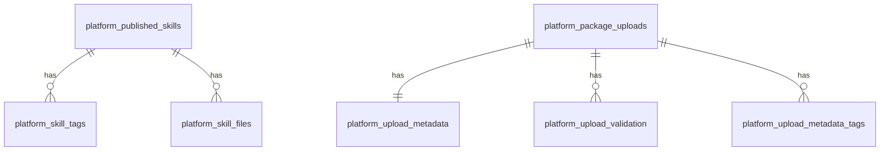

# Platform Database Design

本文档描述 `platform-web` 服务端数据库的初始关系型表结构。当前本地默认使用 SQLite，迁移脚本位于 `packages/server/migrations/001_initial_sqlite.sql`，运行时初始化逻辑位于 `packages/server/src/database.ts`。

数据访问层使用 Drizzle ORM。SQLite 本地驱动使用 `better-sqlite3`，不使用 Node 内置 `node:sqlite`。

## 设计目标

- 使用标准关系表承载平台核心业务数据，避免单表 JSON 文档存储。
- SQLite 作为本地和轻量部署默认数据库。
- 表命名、主键、外键、枚举字段和审计时间保持清晰，方便后续迁移到 MySQL 或 PostgreSQL。
- 通过 ORM schema 和 adapter 隔离数据库访问，后续可替换为 Drizzle MySQL/PostgreSQL driver。
- 少量扩展信息使用 JSON 文本字段保存，例如评价人信息和评价扩展元数据。

## 配置

| 配置项 | 默认值 | 说明 |
| --- | --- | --- |
| `PLATFORM_DATABASE_URL` | `sqlite://packages/server/data/platform.sqlite` | 平台数据库连接地址 |
| `DATABASE_URL` | 无 | `PLATFORM_DATABASE_URL` 未设置时的兼容环境变量 |

## ORM 与驱动

| 层级 | 当前实现 | 后续替换点 |
| --- | --- | --- |
| ORM | `drizzle-orm` | 保持 Drizzle schema/repository 思路 |
| SQLite driver | `better-sqlite3` | 本地开发、单机部署 |
| MySQL driver | 暂未接入 | 可接入 Drizzle MySQL driver |
| PostgreSQL driver | 暂未接入 | 可接入 Drizzle PostgreSQL driver |

当前代码不依赖 Node 自带 SQLite。SQLite 仅作为默认本地数据库，业务读写通过 ORM 层执行。

SQLite URL 示例：

```bash
PLATFORM_DATABASE_URL=sqlite://./packages/server/data/platform.sqlite
```

## 表关系概览



`platform_evaluations.skill_id` 当前用于业务关联和查询索引，但未强制外键，便于评价保留历史快照或引用尚未入库的技能。

## platform_schema_migrations

记录数据库 schema 迁移版本。

| 字段 | 类型 | 约束 | 说明 |
| --- | --- | --- | --- |
| `version` | INTEGER | PRIMARY KEY | 迁移版本号 |
| `applied_at` | TEXT | NOT NULL | 迁移应用时间，ISO 8601 字符串 |

## platform_users

预留平台登录用户表，用于后续将 OAuth/local 用户持久化。

| 字段 | 类型 | 约束 | 说明 |
| --- | --- | --- | --- |
| `id` | TEXT | PRIMARY KEY | 用户 ID，可使用 OAuth `sub` 或本地用户 ID |
| `email` | TEXT | NOT NULL, UNIQUE | 用户邮箱 |
| `name` | TEXT | NOT NULL | 展示名称 |
| `avatar_url` | TEXT | NULL | 头像地址 |
| `role` | TEXT | NOT NULL, CHECK `user/admin` | 平台角色 |
| `created_at` | TEXT | NOT NULL | 创建时间 |
| `updated_at` | TEXT | NOT NULL | 更新时间 |

## platform_sources

技能来源配置表。

| 字段 | 类型 | 约束 | 说明 |
| --- | --- | --- | --- |
| `name` | TEXT | PRIMARY KEY | 来源唯一名称 |
| `label` | TEXT | NOT NULL | 来源展示名 |
| `description` | TEXT | NOT NULL | 来源说明 |
| `enabled` | INTEGER | NOT NULL, DEFAULT 1 | 是否启用，SQLite 使用 0/1 |
| `is_default` | INTEGER | NOT NULL, DEFAULT 0 | 是否内置默认来源 |
| `created_at` | TEXT | NULL | 创建时间 |
| `updated_at` | TEXT | NULL | 更新时间 |

## platform_published_skills

> 这张表只保存平台内上传、审核并发布后的技能记录；从 Git 源拉取的市场技能不会写入这张表，而是从 Git 缓存目录即时扫描返回。

已发布或平台可见的技能主表。

| 字段 | 类型 | 约束 | 说明 |
| --- | --- | --- | --- |
| `id` | TEXT | PRIMARY KEY | 技能 ID |
| `name` | TEXT | NOT NULL | 技能名称 |
| `description` | TEXT | NOT NULL | 技能说明 |
| `author` | TEXT | NOT NULL | 作者或维护团队 |
| `source` | TEXT | NOT NULL | 来源名称 |
| `category` | TEXT | NOT NULL | 分类 |
| `version` | TEXT | NOT NULL | 版本号 |
| `installs` | INTEGER | NOT NULL, DEFAULT 0 | 安装次数 |
| `rating` | REAL | NOT NULL, DEFAULT 0 | 平均评分 |
| `reviews` | INTEGER | NOT NULL, DEFAULT 0 | 评价数量 |
| `status` | TEXT | NOT NULL, CHECK `verified/review/new` | 技能状态 |
| `command` | TEXT | NOT NULL | 安装命令 |
| `owner` | TEXT | NULL | 所有者 |
| `upload_status` | TEXT | NULL, CHECK `draft/validating/validated/waiting_publish/published` | 上传发布状态 |
| `git_url` | TEXT | NULL | 技能来源 Git 地址 |
| `package_file_name` | TEXT | NULL | 上传包文件名 |
| `updated_at` | TEXT | NOT NULL | 更新时间 |

## platform_skill_tags

技能标签表。

| 字段 | 类型 | 约束 | 说明 |
| --- | --- | --- | --- |
| `skill_id` | TEXT | NOT NULL, FK `platform_published_skills(id)` ON DELETE CASCADE | 技能 ID |
| `tag` | TEXT | NOT NULL | 标签 |
| `position` | INTEGER | NOT NULL | 标签展示顺序 |

主键：`(skill_id, tag)`。

## platform_skill_files

技能文件内容表，存储平台编辑器中的技能包文件。

| 字段 | 类型 | 约束 | 说明 |
| --- | --- | --- | --- |
| `skill_id` | TEXT | NOT NULL, FK `platform_published_skills(id)` ON DELETE CASCADE | 技能 ID |
| `path` | TEXT | NOT NULL | 技能包内相对路径 |
| `content` | TEXT | NOT NULL | 文件内容 |
| `updated_at` | TEXT | NOT NULL | 更新时间 |

主键：`(skill_id, path)`。

## platform_evaluations

技能评价与审核反馈表。

| 字段 | 类型 | 约束 | 说明 |
| --- | --- | --- | --- |
| `id` | TEXT | PRIMARY KEY | 评价 ID |
| `skill_id` | TEXT | NOT NULL | 被评价技能 ID |
| `skill_name` | TEXT | NULL | 技能名称快照 |
| `version` | TEXT | NULL | 技能版本快照 |
| `rating` | REAL | NULL | 评分 |
| `title` | TEXT | NULL | 标题 |
| `comment` | TEXT | NULL | 评价内容 |
| `reviewer_json` | TEXT | NULL | 评价人 JSON |
| `status` | TEXT | NOT NULL, CHECK `submitted/reviewing/approved/rejected/archived` | 评价处理状态 |
| `metadata_json` | TEXT | NULL | 扩展元数据 JSON |
| `created_at` | TEXT | NOT NULL | 创建时间 |
| `updated_at` | TEXT | NOT NULL | 更新时间 |

索引：

| 索引 | 字段 | 用途 |
| --- | --- | --- |
| `idx_platform_evaluations_skill_id` | `skill_id` | 按技能查询评价 |
| `idx_platform_evaluations_status` | `status` | 按审核状态筛选 |

## platform_git_config

平台 Git 发布配置表。该表为单行配置表，`id` 固定为 `1`。

| 字段 | 类型 | 约束 | 说明 |
| --- | --- | --- | --- |
| `id` | INTEGER | PRIMARY KEY, CHECK `id = 1` | 固定单例 ID |
| `logged_in` | INTEGER | NOT NULL | Git 登录状态，SQLite 使用 0/1 |
| `user_name` | TEXT | NOT NULL | Git 用户名 |
| `email` | TEXT | NOT NULL | Git 邮箱 |
| `default_git_url` | TEXT | NOT NULL | 默认发布仓库 |
| `default_branch` | TEXT | NOT NULL | 默认分支 |
| `skills_directory` | TEXT | NOT NULL | 技能目录 |
| `publish_strategy` | TEXT | NOT NULL, CHECK `direct/pull_request/review` | 发布策略 |
| `auth_type` | TEXT | NOT NULL, CHECK `none/ssh/token` | 认证类型 |
| `last_test_at` | TEXT | NULL | 最近连接测试时间 |
| `last_test_status` | TEXT | NULL, CHECK `untested/success/failed` | 最近连接测试状态 |

## platform_package_uploads

技能包上传审核记录表。

| 字段 | 类型 | 约束 | 说明 |
| --- | --- | --- | --- |
| `id` | TEXT | PRIMARY KEY | 上传记录 ID |
| `file_name` | TEXT | NOT NULL | 原始文件名 |
| `package_dir` | TEXT | NOT NULL | 解压后的包目录 |
| `original_file_path` | TEXT | NOT NULL | 原始上传文件保存路径 |
| `owner` | TEXT | NOT NULL | 上传人 |
| `status` | TEXT | NOT NULL, CHECK `parsed/waiting_review/rejected/publishing/published/publish_failed` | 上传审核状态 |
| `metadata_skill_id` | TEXT | NOT NULL | 上传包解析出的技能 ID |
| `published_commit` | TEXT | NULL | 发布成功后的 Git commit |
| `publish_error` | TEXT | NULL | 发布失败错误 |
| `created_at` | TEXT | NOT NULL | 创建时间 |
| `updated_at` | TEXT | NOT NULL | 更新时间 |

## platform_upload_metadata

上传包解析出的技能元数据。该表与 `platform_package_uploads` 一对一，避免未发布草稿污染 `platform_published_skills`。

| 字段 | 类型 | 约束 | 说明 |
| --- | --- | --- | --- |
| `upload_id` | TEXT | PRIMARY KEY, FK `platform_package_uploads(id)` ON DELETE CASCADE | 上传记录 ID |
| `skill_id` | TEXT | NOT NULL | 解析出的技能 ID |
| `name` | TEXT | NOT NULL | 技能名称 |
| `description` | TEXT | NOT NULL | 技能说明 |
| `author` | TEXT | NOT NULL | 作者 |
| `source` | TEXT | NOT NULL | 来源 |
| `category` | TEXT | NOT NULL | 分类 |
| `version` | TEXT | NOT NULL | 版本 |
| `installs` | INTEGER | NOT NULL, DEFAULT 0 | 安装次数 |
| `rating` | REAL | NOT NULL, DEFAULT 0 | 平均评分 |
| `reviews` | INTEGER | NOT NULL, DEFAULT 0 | 评价数量 |
| `status` | TEXT | NOT NULL, CHECK `verified/review/new` | 技能状态 |
| `command` | TEXT | NOT NULL | 安装命令 |
| `owner` | TEXT | NULL | 所有者 |
| `upload_status` | TEXT | NULL, CHECK `draft/validating/validated/waiting_publish/published` | 上传发布状态 |
| `git_url` | TEXT | NULL | Git 地址 |
| `package_file_name` | TEXT | NULL | 上传包文件名 |
| `updated_at` | TEXT | NOT NULL | 更新时间 |

## platform_upload_validation

上传包校验结果表。

| 字段 | 类型 | 约束 | 说明 |
| --- | --- | --- | --- |
| `upload_id` | TEXT | NOT NULL, FK `platform_package_uploads(id)` ON DELETE CASCADE | 上传记录 ID |
| `code` | TEXT | NOT NULL | 校验项代码 |
| `message` | TEXT | NOT NULL | 校验说明 |
| `severity` | TEXT | NOT NULL, CHECK `info/warning/error` | 严重级别 |
| `position` | INTEGER | NOT NULL | 展示顺序 |

主键：`(upload_id, position)`。

## platform_upload_metadata_tags

上传包元数据标签表。

| 字段 | 类型 | 约束 | 说明 |
| --- | --- | --- | --- |
| `upload_id` | TEXT | NOT NULL, FK `platform_package_uploads(id)` ON DELETE CASCADE | 上传记录 ID |
| `tag` | TEXT | NOT NULL | 标签 |
| `position` | INTEGER | NOT NULL | 标签展示顺序 |

主键：`(upload_id, tag)`。

## 枚举约束

| 字段 | 可选值 |
| --- | --- |
| `platform_users.role` | `user`, `admin` |
| `platform_published_skills.status` | `verified`, `review`, `new` |
| `platform_published_skills.upload_status` | `draft`, `validating`, `validated`, `waiting_publish`, `published` |
| `platform_evaluations.status` | `submitted`, `reviewing`, `approved`, `rejected`, `archived` |
| `platform_git_config.publish_strategy` | `direct`, `pull_request`, `review` |
| `platform_git_config.auth_type` | `none`, `ssh`, `token` |
| `platform_git_config.last_test_status` | `untested`, `success`, `failed` |
| `platform_package_uploads.status` | `parsed`, `waiting_review`, `rejected`, `publishing`, `published`, `publish_failed` |
| `platform_upload_validation.severity` | `info`, `warning`, `error` |

## 跨数据库迁移建议

SQLite 当前使用：

- `TEXT` 存储字符串、时间、JSON 文本。
- `INTEGER` 的 `0/1` 表示布尔值。
- `REAL` 表示评分。
- `CHECK` 约束表示枚举。

迁移到 PostgreSQL 时建议：

- 时间字段从 `TEXT` 改为 `TIMESTAMPTZ`。
- JSON 文本字段从 `TEXT` 改为 `JSONB`。
- 布尔字段从 `INTEGER` 改为 `BOOLEAN`。
- 枚举可继续使用 `CHECK`，或改为 PostgreSQL enum type。

迁移到 MySQL 时建议：

- 时间字段从 `TEXT` 改为 `DATETIME(3)`。
- JSON 文本字段从 `TEXT` 改为 `JSON`。
- 布尔字段可使用 `TINYINT(1)`。
- 枚举可使用 `CHECK`，如果目标 MySQL 版本较旧则改为应用层校验或 `ENUM`。

## 当前注意事项

- `platform_users` 已设计但当前登录会话仍通过 HttpOnly cookie 管理，用户持久化可在后续迭代接入。
- `platform_upload_metadata` 与 `platform_published_skills` 分离，只有审核发布成功后的技能才进入 `platform_published_skills`。
- `platform_evaluations.skill_id` 未设置外键，用于支持历史评价快照和离线/草稿技能引用。
