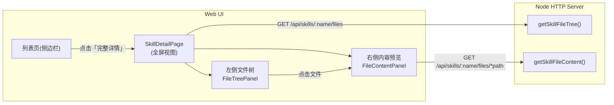
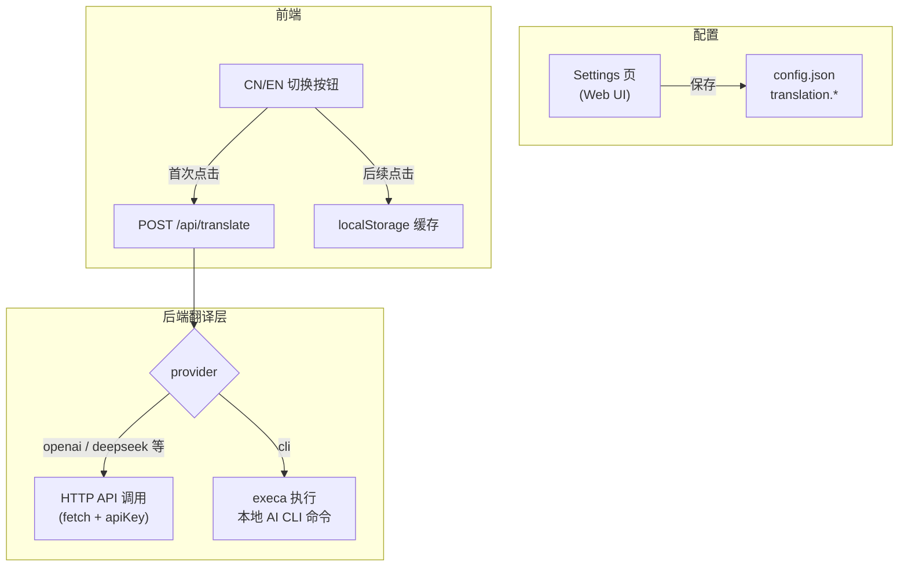

# Skill 翻译 + 文件浏览器详情页

## 功能一：Skill 详情文件浏览器

### 现状
- 当前：点击 skill 卡片 → 侧边栏只渲染 `SKILL.md` Markdown
- 目标：侧边栏增加「查看完整详情」入口 → 跳转到全屏详情视图

### 架构设计（文件浏览器）



### 后端改动（`apps/cli/src/lib/web/`）

- **`api.ts`** - 新增两个函数：
  - `getSkillFileTree(ctx, skillName, options)` → 递归读取 `skillDir`，返回文件树 JSON（忽略 `.git` 等）
  - `getSkillFileContent(ctx, skillName, filePath, options)` → 读取单文件内容，带路径越界安全检查
- **`server.ts`** - 注册两条路由：
  - `GET /api/skills/:name/files`
  - `GET /api/skills/:name/files/*`
- **`packages/core/src/types/index.ts`** - 新增类型：
  - `WebSkillFileNode` (name, path, type: 'file'|'dir', children?)
  - `WebSkillFileContent` (path, content?, encoding: 'text'|'base64'|'binary', previewable: boolean)
  - 所有文件都在树中显示；文本文件展示内容，图片 base64 渲染，其他二进制显示「无法预览」提示

### 前端改动（`apps/local-web/src/`）

- **`api/client.ts`** - 新增 `fetchSkillFiles()`, `fetchSkillFileContent()`
- **`App.tsx`** - 新增 `SkillDetailView` 组件（独立视图，类 View = 'skill-detail'），包含：
  - 左侧 `FileTree` 组件，展示目录树，可折叠
  - 右侧 `FileContent` 组件，文本文件渲染 Markdown 或代码高亮（`.md` / `.json` / 其他）
  - 顶部面包屑导航（← 返回列表）
  - 现有侧边栏的「查看完整详情」按钮触发跳转

---

## 功能二：翻译功能

### 翻译服务架构



### 翻译配置类型（`packages/core/src/types/index.ts`）

```typescript
interface TranslationConfig {
  provider: 'openai' | 'cli' | 'none';
  // provider = 'openai'
  apiBaseUrl?: string;   // 默认 https://api.openai.com/v1
  apiKey?: string;
  model?: string;        // 默认 gpt-4o-mini
  // provider = 'cli'
  cliCommand?: string;   // 如 "claude" 或 "openai"
  cliArgs?: string[];    // 如 ["--model", "claude-opus-4-5"]
}
```

### 后端改动

- **`api.ts`** - 新增 `translateText(ctx, text, targetLang)` 函数
  - 读取 `config.translation`，按 provider 分发
  - CLI 模式：通过 `execFile` 调用本地命令，将文本 pipe 给 stdin
  - API 模式：发起 HTTP POST 请求
- **`server.ts`** - 注册 `POST /api/translate`（body: `{ text, target? }`）
- **`config.ts`** - 添加 `translation` 字段默认值（provider: 'none'）

### 前端改动

- **`App.tsx`** - 在侧边栏详情区域（`MarkdownView` 上方）增加 `TranslateToggle` 按钮
  - 状态：original / loading / translated
  - 翻译范围：全部内容（列表卡片 description、详情 SKILL.md、文件浏览器任意文件）
  - 翻译结果以 `{skillName}:{filePath}` 为 key 缓存到 `localStorage`
  - 文件浏览器中的文件内容预览区复用同一按钮
  - 列表页每张卡片的 description 旁增加翻译图标（按需懒翻译）
- **Settings 页面** - 新增「翻译配置」区块，字段对应 `TranslationConfig`

---

## 改动文件汇总

| 文件 | 改动 |
|------|------|
| [`packages/core/src/types/index.ts`](packages/core/src/types/index.ts) | 新增 `WebSkillFileNode`、`TranslationConfig` 类型 |
| [`apps/cli/src/lib/web/api.ts`](apps/cli/src/lib/web/api.ts) | 新增文件树、文件内容、翻译 API 函数 |
| [`apps/cli/src/lib/web/server.ts`](apps/cli/src/lib/web/server.ts) | 注册新路由 |
| [`packages/core/src/config/index.ts`](packages/core/src/config/index.ts) | 翻译配置默认值 |
| [`apps/local-web/src/api/client.ts`](apps/local-web/src/api/client.ts) | 新增前端 API 函数 |
| [`apps/local-web/src/App.tsx`](apps/local-web/src/App.tsx) | 新增详情视图组件、翻译按钮、Settings 配置区 |
