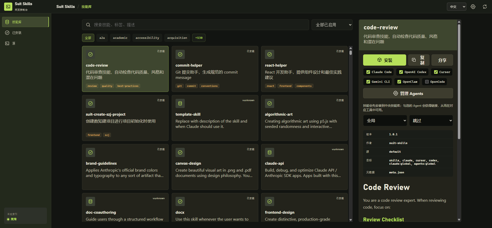
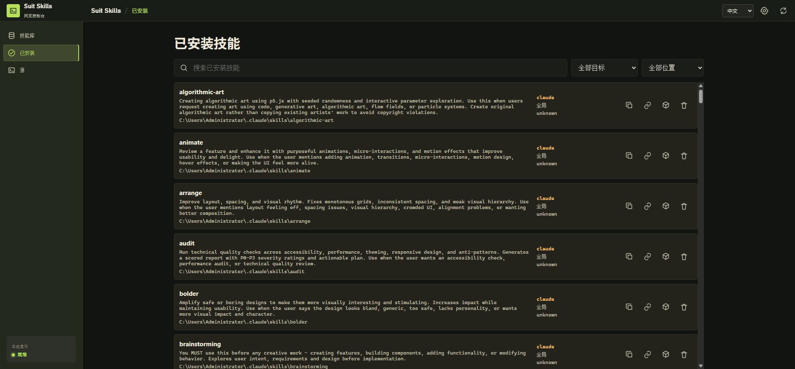
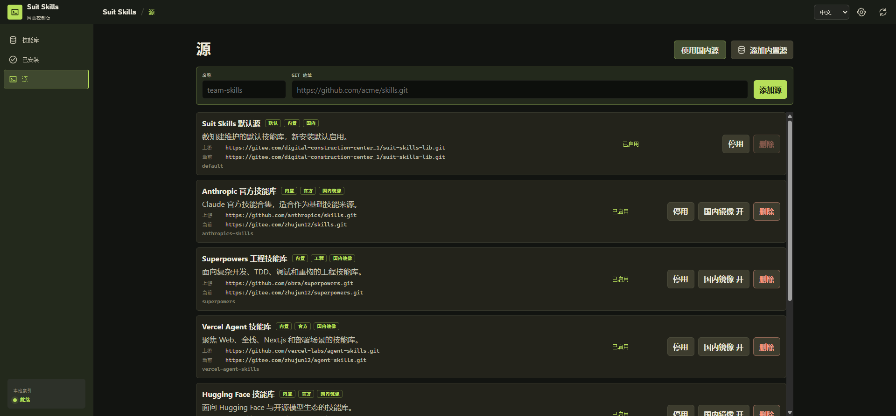

# suit-skills

用于管理 AI Agent skills 的本地工具，支持 CLI、Web 控制台、桌面应用和 Platform Web Hub。它可以从远程 skill source 拉取技能库，并将 skill 安装到 Claude Code、Cursor、OpenAI Codex、Gemini CLI、OpenCode、OpenClaw 等常见智能体目录。

更详细的维护文档见 [docs/README.md](./docs/README.md)。

[](https://github.com/zhujunzhujunzhu/suit-skills)
[](https://gitee.com/zhujun12/suit-skills-cli)
[](https://www.npmjs.com/package/suit-skills)

## 功能特性

- 从内置或自定义 source 浏览、搜索、安装和更新 skills。
- 支持全局安装和项目安装，并可安装到多个 Agent 目标目录。
- Web 控制台提供技能库、已安装技能、source 管理、设置和下载入口。
- 支持导出已安装 skill、复制安装包、将已安装 skill 链接到其他目标。
- 支持国内镜像配置，便于访问常见开源 skill source。
- 提供 Tauri 桌面应用构建入口。
- 保留 Platform Web Hub 入口，用于后续在线技能分发和团队协作。

## 环境要求

- Node.js >= 18
- npm >= 9
- 可访问已配置的 Git skill source

## 安装

推荐直接通过 `npx` 使用最新版：

```bash
npx suit-skills@latest web
```

也可以全局安装：

```bash
npm install -g suit-skills
suit-skills --help
```

## 快速开始

### 打开 Web 控制台

```bash
npx suit-skills@latest web
```

默认会监听 `http://127.0.0.1:4587` 并自动打开浏览器。常用参数：

```bash
suit-skills web --port 8080
suit-skills web --host 127.0.0.1
suit-skills web --source all
suit-skills web --no-open
```

### 使用 CLI 安装 skill

```bash
# 查看默认 source 中可安装的 skills
suit-skills list

# 搜索 skill
suit-skills search <keyword>

# 查看 skill 详情
suit-skills info <skill-name>

# 安装到默认目标，默认是全局安装
suit-skills install <skill-name>

# 安装到当前项目目录
suit-skills install <skill-name> --local

# 指定单个目标
suit-skills install <skill-name> --agent claude

# 指定多个目标
suit-skills install <skill-name> --env claude,codex,cursor
```

## CLI 命令

### 技能库

| 命令 | 说明 |
| --- | --- |
| `suit-skills list` / `suit-skills ls` | 列出 source 中可安装的 skills |
| `suit-skills list --source all` | 聚合所有已启用 source 的 skills |
| `suit-skills list --query <keyword>` | 按关键词过滤列表 |
| `suit-skills list --tag <tag>` | 按标签过滤列表 |
| `suit-skills search <keyword>` | 搜索 skills |
| `suit-skills info <name>` | 查看 skill 详情 |

### 安装与管理

| 命令 | 说明 |
| --- | --- |
| `suit-skills install <name>` | 安装 skill，默认安装到全局目录 |
| `suit-skills install <name> --local` | 安装到当前项目目录 |
| `suit-skills install <name> --agent <target>` | 只安装到指定目标 |
| `suit-skills install <name> --env <csv>` | 本次安装使用多个目标 |
| `suit-skills install <name> --strategy overwrite` | 冲突时覆盖，默认策略 |
| `suit-skills install <name> --strategy skip` | 冲突时跳过 |
| `suit-skills install <name> --strategy rename` | 冲突时重命名 |
| `suit-skills installed` | 查看项目级已安装 skills |
| `suit-skills installed --global` | 查看全局已安装 skills |
| `suit-skills installed --scope all` | 同时查看项目级和全局安装 |
| `suit-skills update [name]` | 更新已安装 skills |
| `suit-skills update [name] --global` | 更新全局安装的 skills |
| `suit-skills remove <name>` / `suit-skills rm <name>` | 删除已安装 skill |
| `suit-skills remove <name> --global` | 删除全局安装的 skill |

### Source 管理

| 命令 | 说明 |
| --- | --- |
| `suit-skills source list` | 查看所有 source |
| `suit-skills source add <name> <url>` | 新增 source |
| `suit-skills source enable <name>` | 启用 source |
| `suit-skills source disable <name>` | 禁用 source |
| `suit-skills source default <name>` | 设置默认 source |
| `suit-skills source remove <name>` | 删除 source |
| `suit-skills source restore-builtins` | 恢复缺失的内置 source |
| `suit-skills source mirror <name> on` | 启用内置 source 的国内镜像 |
| `suit-skills source mirror <name> off` | 关闭内置 source 的国内镜像 |

### 配置与目标

| 命令 | 说明 |
| --- | --- |
| `suit-skills config list` | 输出完整配置 |
| `suit-skills config get <path>` | 读取配置项 |
| `suit-skills config set <path> <value>` | 写入配置项 |
| `suit-skills env list` | 查看安装目标和环境提示 |
| `suit-skills env set <csv>` | 设置默认安装目标 |
| `suit-skills env auto on` | 开启项目目录自动检测 |
| `suit-skills env auto off` | 关闭项目目录自动检测 |
| `suit-skills targets list` | 查看 Web UI 可选安装目标 |
| `suit-skills targets add <id>` | 添加自定义安装目标 |
| `suit-skills targets edit <id>` | 编辑安装目标目录 |
| `suit-skills targets remove <id>` | 删除自定义安装目标 |

### 分享与导出

| 命令 | 说明 |
| --- | --- |
| `suit-skills export <name> --target <target>` | 将已安装 skill 导出为 zip |
| `suit-skills copy-package <name> --target <target>` | 复制已安装 skill 的 zip 包到剪贴板 |
| `suit-skills link-targets <name> --target <source> --targets <csv>` | 将已安装 skill 链接到其他目标 |

示例：

```bash
suit-skills export code-review --target claude --out ./code-review.zip
suit-skills link-targets code-review --target claude --targets codex,cursor
```

## 安装目标

内置安装目标包括：

| target | 全局目录 | 项目目录 |
| --- | --- | --- |
| `agents` | `~/.agents/skills` | `./.agents/skills` |
| `claude` | `~/.claude/skills` | `./.claude/skills` |
| `cursor` | `~/.cursor/skills` | `./.cursor/skills` |
| `codex` | `~/.codex/skills` | `./.codex/skills` |
| `gemini` | `~/.gemini/skills` | `./.gemini/skills` |
| `opencode` | `~/.opencode/skills` | `./.opencode/skills` |
| `openclaw` | `~/.openclaw/skills` | `./.openclaw/skills` |
| `copilot` | `~/.copilot/skills` | `./.copilot/skills` |
| `skills` | `~/.suit-skills/skills` | `./.skills` |

安装目标选择优先级：

1. 传入 `--agent <target>` 时，只使用该目标。
2. 传入 `--env <csv>` 时，使用 CSV 中指定的多个目标。
3. 否则使用配置中的 `installTargets`。
4. 如果 `installTargetsAuto` 未关闭，会合并当前项目中已检测到的智能体目录。

默认安装是全局安装；需要安装到当前项目时使用 `--local`。

## Web 控制台

启动：

```bash
suit-skills web
```

Web 控制台主要页面：

- **Library**：浏览、搜索和安装 source 中的 skills。
- **Installed**：查看、删除、导出和链接已安装 skills。
- **Sources**：新增、启用、禁用、删除 source，并配置国内镜像。
- **Settings**：管理刷新间隔、主题、翻译和 AI 修改配置。
- **Download**：查看桌面端版本和下载入口。

### 界面预览

#### 技能库



#### 已安装技能



#### Source 管理



## 桌面应用

桌面应用基于 Tauri，提供独立窗口，无需通过浏览器访问。

```bash
# 构建 Web 与 CLI
npm run build:all

# 构建 sidecar
npm run build:sidecar

# 构建桌面安装包
npm run build:desktop
```

构建产物位于：

```text
src-tauri/target/release/bundle/
```

## 本地开发

```bash
# 安装依赖
npm install

# CLI 开发模式
npm run dev

# Web 开发模式
npm run dev:web

# 类型检查
npm run typecheck

# 单元测试
npm test

# E2E 测试
npm run test:e2e

# 构建 CLI 和 Web
npm run build:all
```

## 配置目录

默认配置目录：

```text
~/.suit-skills/
```

常见文件和目录：

```text
~/.suit-skills/config.json
~/.suit-skills/cache/
~/.suit-skills/skills/
```

可以通过 `SUIT_SKILLS_HOME` 指定隔离配置目录：

```bash
SUIT_SKILLS_HOME=/path/to/.suit-skills suit-skills config list
```

PowerShell：

```powershell
$env:SUIT_SKILLS_HOME="D:\tmp\suit-skills-home"
suit-skills config list
```

## Skill 格式

推荐每个 skill 使用独立目录，并在 `SKILL.md` 顶部写入 frontmatter：

```text
my-skill/
  SKILL.md
```

```markdown
---
name: code-review
version: 1.0.0
description: 自动检查代码质量、风格和潜在问题
author: suit-skills
tags:
  - review
  - quality
---

# code-review

这里编写 skill 的使用说明。
```

兼容说明：

- 新 skill 推荐使用 `SKILL.md` frontmatter。
- 旧版 `meta.json` 可作为元数据 fallback。
- 如果元数据缺失，界面和 CLI 可能显示 `unknown`。

## 常见问题

### 安装到了哪里？

`install` 默认安装到全局目录。传入 `--local` 后安装到当前项目目录。传入 `--agent` 或 `--env` 可以指定目标目录。

### 找不到 skill 怎么办？

可以先刷新并检查 source：

```bash
suit-skills source list
suit-skills list --source all --refresh
suit-skills info <skill-name> --source all --refresh
```

### 如何只使用国内镜像？

内置 source 支持镜像开关：

```bash
suit-skills source mirror anthropics-skills on
suit-skills source list
```

### 如何固定默认安装目标？

```bash
suit-skills env set claude,codex,cursor
suit-skills env auto off
```

## 链接

- [GitHub 仓库](https://github.com/zhujunzhujunzhu/suit-skills)
- [Gitee 仓库](https://gitee.com/zhujun12/suit-skills-cli)
- [npm 包](https://www.npmjs.com/package/suit-skills)

## License

请以仓库中的 [LICENSE](./LICENSE) 文件为准。
